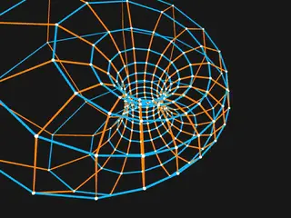

# 4D VR in Unity

Unity VR experience for interacting with 4-dimensional geometric objects in 3D.

|  |
|:--:|
| *Animation of a 4D flat torus rotated diagonally in 4 dimensions* |

Based on Unity 2018.1.
